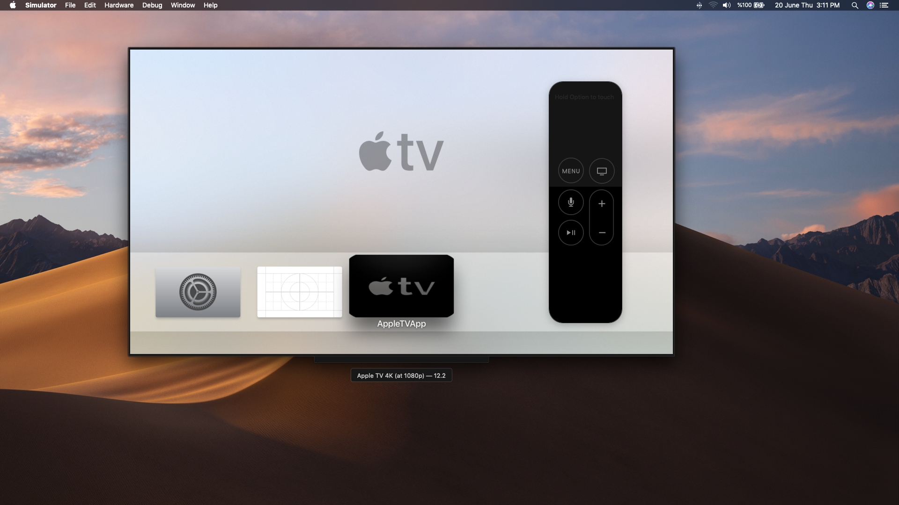
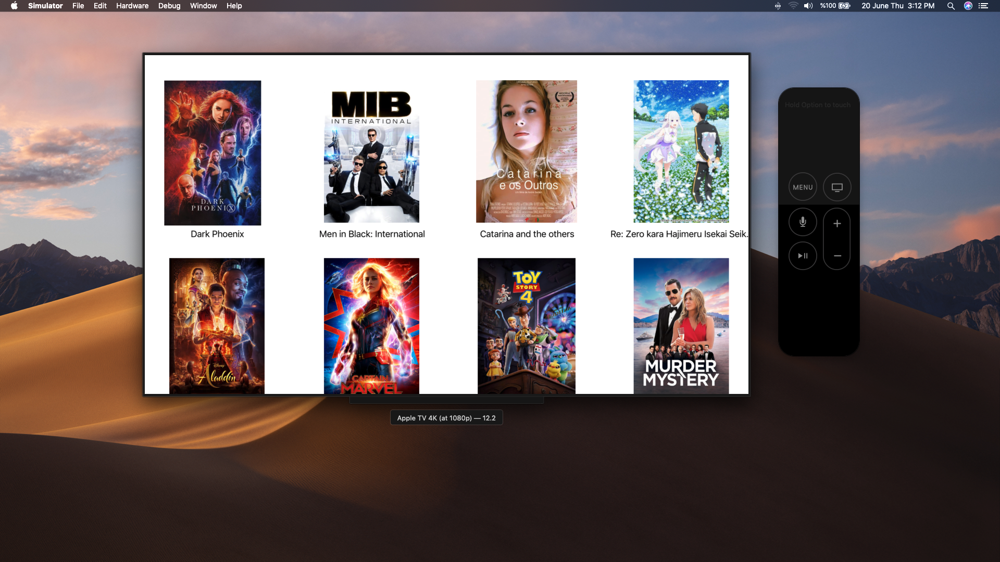

# Apple TV App 


This is Apple TV application. The application was made using API.

## tvOS SDK

Leverage many of the same frameworks, technologies, and concepts as iOS. Frameworks and technologies, such as Metal, UIKit, CloudKit, and Game Center, let you create rich games and apps that look amazing on Apple TV. TVMLKit templates using XML and JavaScript are available as a framework for tvOS apps and let you use predefined layouts and JavaScript APIs to quickly create beautiful apps ideal for streaming media. And you can use SwiftUI to customize your app interfaces and provide even more functionality.

## Developing tvOS apps

Your tvOS apps can deliver amazing experiences with stunning picture quality through 4K resolution, Dolby Vision, and HDR10 — and immersive sound through Dolby Atmos. And with Picture in Picture, multiuser, and game controller support, you can create even more engaging gaming and interactive experiences.


## Creating apps for Apple TV

We’ve reimagined the TV experience with tvOS — an innovative TV platform that redefines what can be done in the living room. Apple TV features a built-in App Store, making it more entertaining than ever. Now you can deliver incredible and immersive apps and games on the big screen.


# Screenshots








## License ℹ️
```
MIT License

Copyright (c) 2022 Halil OZEL

Permission is hereby granted, free of charge, to any person obtaining a copy
of this software and associated documentation files (the "Software"), to deal
in the Software without restriction, including without limitation the rights
to use, copy, modify, merge, publish, distribute, sublicense, and/or sell
copies of the Software, and to permit persons to whom the Software is
furnished to do so, subject to the following conditions:

The above copyright notice and this permission notice shall be included in all
copies or substantial portions of the Software.

THE SOFTWARE IS PROVIDED "AS IS", WITHOUT WARRANTY OF ANY KIND, EXPRESS OR
IMPLIED, INCLUDING BUT NOT LIMITED TO THE WARRANTIES OF MERCHANTABILITY,
FITNESS FOR A PARTICULAR PURPOSE AND NONINFRINGEMENT. IN NO EVENT SHALL THE
AUTHORS OR COPYRIGHT HOLDERS BE LIABLE FOR ANY CLAIM, DAMAGES OR OTHER
LIABILITY, WHETHER IN AN ACTION OF CONTRACT, TORT OR OTHERWISE, ARISING FROM,
OUT OF OR IN CONNECTION WITH THE SOFTWARE OR THE USE OR OTHER DEALINGS IN THE
SOFTWARE.
```
